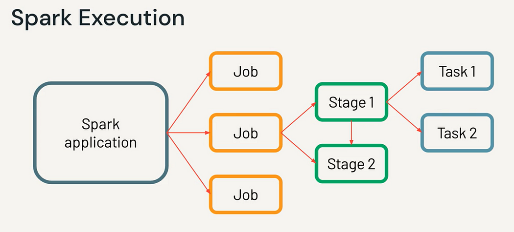
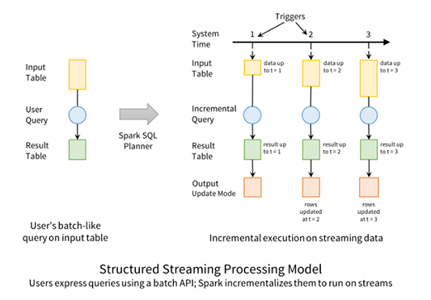

# Apache Spark 

## 1. Visión xeral de Spark

Apache Spark é un motor de computación distribuída orientado ao procesamento eficiente de grandes volumes de datos, tanto en modo batch como streaming. A principal diferenza respecto de Hadoop-MapReduce é que traballa en memoria.


---

## 2. Arquitectura distribuída

### 2.1 Diagrama xeral

*Fonte: Documentación oficial de Apache Spark*  
https://spark.apache.org/docs/latest/
O diagrama representa a arquitectura básica dun clúster Spark e mostra como se distribúe a execución dunha aplicación entre os diferentes compoñentes:

#### Driver
É o proceso principal da aplicación. Contén a SparkSession, planifica o traballo, constrúe o plan de execución (Jobs → Stages → Tasks) e coordina a comunicación co resto do clúster.

#### Cluster Manager
É o sistema encargado de xestionar os recursos (CPU, memoria, executores). Spark pode traballar con diferentes xestores de recursos: Standalone, YARN, Kubernetes ou Mesos. O Driver solicita executores ao cluster manager e este asínallos nos nodos dispoñibles.

#### Executors
Son procesos distribuídos, executados en nodos worker. Cada executor executa múltiples tasks en paralelo e almacena datos en memoria ou disco local. Ademais, manteñen información de estado, métricas e resultados parciais.

---

## 3. Modelo de execución

### 3.1 Fluxo interno

```
Transformacións → Plan Lóxico → Optimización (Catalyst)
        ↓
Plan Físico → División en Stages → Envío de Tasks
        ↓
  Executors procesan particións
        ↓
     Resultados ao Driver
```

#### **1. Transformacións**
Son as operacións declaradas polo usuario (select, filter, join, groupBy…).  
Estas operacións son **perezosas (lazy)**: Spark non as executa no momento de escribilas, senón que construirá un grafo de operacións pendentes.


#### **2. Plan lóxico**
Spark traduce as transformacións declaradas polo usuario a un **árbore lóxica** que describe *que* se debe facer, pero aínda non *como*.

Neste punto o plan:
- Non ten información física sobre particións
- Non escolle estratexias de join
- Non decidiu onde dividir en stages

É un modelo abstracto do cálculo.


#### **3. Optimización (Catalyst)**
O optimizador **Catalyst** aplica múltiples regras de optimización ao plan lóxico, entre elas:
- Simplificación de expresións
- Eliminación de columnas ou operacións innecesarias
- *Predicate pushdown* (baixar filtros canto antes)
- Reordenación de joins
- Fusión de operacións compatibles

Ao final desta fase obténse un **plan lóxico optimizado**.


#### **4. Plan físico**
Catalyst traduce o plan lóxico optimizado a un **plan físico**, que define:
- Estratexia de execución de joins (broadcast, sort-merge, shuffle hash…)
- Operacións que requiren *shuffle*  
- Número de stages
- Distribución das particións

O plan físico describe *como* se executará realmente a consulta no clúster.


#### **5. División en Stages**
O planificador divide o traballo en **stages** en función das operacións que requiren *shuffle*.  
Cada stage agrupa tarefas que:
- Poden executarse en paralelo
- Non dependen de datos doutras particións

As operacións con dependencias *narrow* van na mesma stage; as *wide* obrigan a crear stages novas.


#### **6. Envío de Tasks**
Cada stage divídese en **tasks**, unha por partición.  
O Driver envía estas tasks aos executors segundo a dispoñibilidade de recursos no clúster.


#### **7. Os executors procesan as particións**
Cada executor:
- Procesa unha ou varias tasks
- Traballa sobre particións de datos
- Pode almacenar os resultados intermedios en memoria (*cache*) ou disco local
- Comunica avances e métricas ao Driver

Este é o núcleo do procesamento distribuído.


#### **8. Resultados ao Driver**
Unha vez todas as tasks completan a súa execución:
- Agréganse ou combinan os resultados (se procede)
- O resultado final devólvese ao Driver
- Se a acción o require (`collect`, `count`…), o Driver devolve o resultado ao usuario
---

### 3.2 Jobs, Stages e Tasks

```
+--------------------------------------------------------------+
|                          JOB                                 |
|   (xérase cando se executa unha ACCIÓN)                      |
+--------------------------------------------------------------+
         |                          |
         | shuffle                  | shuffle
         v                          v
   +------------+           +--------------+
   |  STAGE 1   |           |   STAGE 2    |
   | narrow ops |           | narrow ops   |
   +------------+           +--------------+
         |                          |
         v                          v
  +----+----+                 +----+----+
  | Task 1 |                 | Task 1 |
  | Task 2 |                 | Task 2 |
  | Task 3 |                 | Task 3 |
  +--------+                 +--------+
```
En Spark, o proceso de execución dunha aplicación organízase en tres niveis xerárquicos: **Job → Stages → Tasks**. Cada nivel representa unha granularidade distinta do traballo distribuído.

#### JOB  
Un **Job** xérase cando o usuario executa unha **acción** (como `count`, `show`, `collect`, `write`).  
Un Job representa o conxunto completo de operacións necesarias para obter o resultado desa acción.  
É a unidade lóxica máis grande do procesamento.

#### STAGE  
Un Job divídese en varios **Stages**.  
Cada Stage agrupa operacións con **dependencias narrow**, que poden executarse sen redistribución de datos.  
A aparición dun **shuffle** (como nun `join`, `groupBy`, `distinct`…) obriga a dividir o Job en novas stages.  
Polo tanto, un Stage é un bloque de traballo continuo sen movemento de datos entre nodos.

#### TASK  
Cada Stage divídese en **Tasks**, unha por cada **partición** de datos que necesita ser procesada.  
Unha Task é a unidade de execución máis pequena e realiza o traballo real sobre unha partición.  
As Tasks execútanse en paralelo entre os distintos executors.

---

## 4. Dependencias
Ao determinar como se executan as transformacións nun clúster, Spark clasifica as dependencias entre particións en dous tipos fundamentais: **narrow** e **wide**. Esta distinción é clave para comprender o rendemento, o paralelismo e a creación de stages.

### 4.1 Narrow vs Wide

```
NARROW DEPENDENCY (sen shuffle)
---------------------------------
Partición A ----> Partición A'
Partición B ----> Partición B'
Partición C ----> Partición C'

WIDE DEPENDENCY (con shuffle)
---------------------------------
Partición A ----Partición B ------> Partición X'
Partición C ----/
```

#### Narrow Dependency
Nunha **narrow dependency**, cada partición de saída depende **só dunha partición de entrada**.  
Isto significa que o procesamento pode realizarse **localmente e en paralelo**, sen necesidade de mover datos entre nodos.

Exemplos típicos:
- `map`
- `filter`
- `withColumn`
- `sample`
- `mapValues`

Características:
- Máximo paralelismo
- Non hai *shuffle*
- Execútanse dentro da mesma *stage*
- Moi eficiente en clusters distribuídos

#### Wide Dependency
unha **wide dependency**, cada partición de saída depende de **varias particións de entrada**.  
Para poder procesar a operación, Spark necesita **redistribuír datos** entre nodos → isto chámase **shuffle**.

Exemplos típicos:
- `groupBy`
- `reduceByKey`
- `distinct`
- `join`
- `sort`

Características:
- Requere *shuffle* (custe alto)
- Crea unha nova *stage*
- Reduce o paralelismo efectivo
- Pode implicar escritura/lectura en disco e transferencia por rede

---

## 5. Catalyst + Tungsten
Apache Spark incorpora dous compoñentes fundamentais para acadar un rendemento elevado nas operacións con DataFrames e Spark SQL: **Catalyst** e **Tungsten**.  
Ambos forman parte do corazón do motor de execución moderno de Spark.
```
              +-----------------------+
              |   Consulta/DataFrame  |
              +-----------+-----------+
                          |
                          v
                +------------------+
                |  Plan Lóxico     |
                +------------------+
                          |
                (Regras Catalyst)
                          |
                          v
                +------------------+
                |  Plan Físico     |
                +------------------+
                          |
                (Tungsten: execución optimizada)
                          |
                          v
                 +-----------------+
                 |     Executors   |
                 +-----------------+
```
### Catalyst Optimizer
**Catalyst** é o optimizador de consultas de Spark.  
É un motor baseado en regras (*rule-based optimizer*) encargado de transformar e optimizar o **plan lóxico** das operacións antes de que se executen.

As súas funcións principais son:

- **Análise do plan lóxico** das operacións (select, filter, join, groupBy…)
- **Optimización mediante regras**, tales como:
  - *Predicate pushdown* (aplicar filtros canto antes)
  - Eliminación de columnas innecesarias
  - Simplificación de expresións
  - Reordenación de joins
  - Fusión de operacións compatibles
- **Xerar o plan físico**, decidindo:
  - Estratexia de joins (broadcast, sort-merge…)
  - Necesidade de *shuffle*
  - Número de stages

Catalyst actúa sobre DataFrames e SQL, e é un dos motivos polos que Spark pode ser moito máis eficiente que outros motores similares.

---

### Tungsten Execution Engine
**Tungsten** é o motor de execución física introducido para mellorar o rendemento baixo nivel de Spark.  
O seu obxectivo é optimizar ao máximo a utilización da CPU e da memoria.

Principais características:

- **Xestión eficiente da memoria** evitando sobrecarga do *Garbage Collector*  
  (usa estruturas binarias compactas).
- **Execución vectorizada**, procesando múltiples valores por operación.
- **Code generation (Whole-stage code generation)**:  
  Spark xera código máquina optimizado en tempo de execución para evitar ciclos innecesarios na CPU.
- **Formato columnar optimizado**, compatible con Parquet e Arrow.
- **Menor custo de serialización/deserialización**.

Tungsten complementa a Catalyst:  
- **Catalyst decide *que* facer e *como planificalo***  
- **Tungsten decide *como executalo* ao nivel máis eficiente posible**

---

## 6. Modos de execución
### 1. Modo Local

Spark executa **Driver** e **Executors** na mesma máquina. Ideal para probas, desenvolvemento e aprendizaxe.

```
+--------------------------------------------------+
|                   MODO LOCAL                     |
|                                                  |
|  +-----------+        +-----------------------+  |
|  |  Driver   | -----> |   Executors (threads) |  |
|  +-----------+        +-----------------------+  |
|                                                  |
|     Todo ocorre na mesma máquina física          |
+--------------------------------------------------+
```

---

### 2. Modo Client

O Driver execútase na **máquina cliente** (por exemplo, un portátil), mentres que os Executors viven no clúster. O cliente debe permanecer conectado.

```
                     Máquina do Cliente
+------------------------------------------------------+
|  +-----------+                                       |
|  |  Driver   |   (envía jobs, stages, tasks)         |
|  +-----------+                                       |
+------------------------------------------------------+
                | Rede / Latencia |
                v                 v
+------------------------------------------------------+
|                      CLÚSTER                         |
|  +-------------------+   +-------------------------+  |
|  |   Executor 1      |   |     Executor N         |  |
|  +-------------------+   +-------------------------+  |
|                                                      |
|     Os executors están no clúster, o driver non      |
+------------------------------------------------------+
```

---

### 3. Modo Cluster

O Driver execútase **dentro do clúster**. O cliente pode desconectarse sen interromper a execución.

```
O usuario só envía a aplicación → o driver vive no clúster

                     (spark-submit)
                           |
                           v
+------------------------------------------------------+
|                 CLUSTER MANAGER                      |
|------------------------------------------------------|
|  +-----------------+      +------------------------+ |
|  |  Driver (nodo)  | ---> | Executors distribuídos | |
|  |  dentro do      |      | polo clúster           | |
|  |   clúster       |      +------------------------+ |
|  +-----------------+                                   |
+------------------------------------------------------+

O cliente pode desconectarse: a execución continúa no clúster
```

---

## 7. Ciclo de vida dunha aplicación

```
1) Envío da aplicación (spark-submit)
2) O cluster manager asigna recursos
3) Lánzase o Driver
4) Créanse executors
5) Execútanse Tasks por partición
6) Devólvense resultados
7) Libéranse recursos
```

---

## 8. Introdución Spark Structured Streaming
Spark Structured Streaming é o modelo de procesamento de datos en tempo real de Apache Spark.  
Está deseñado para ofrecer un fluxo de datos continuo baseado na mesma API de **DataFrames e SQL**, de forma que traballar con *streaming* é conceptualmente igual que traballar con datos batch.

Structured Streaming considera un fluxo como unha **táboa infinita**, onde cada novo dato que chega equivale a engadir novas filas.

---

### Principios fundamentais

- **Unificación Batch/Streaming**  
  A mesma API, os mesmos operadores e o mesmo optimizador Catalyst.  
  Un único modelo mental, tanto para datos estáticos como dinámicos.

- **Procesamento incremental**  
  Cada nova chegada de datos (microbatch ou modo continuo) xera un *DataFrame incremental* que se procesa co mesmo motor SQL.

- **Semántica consistente**  
  Pódense garantir propiedades como *at-least-once* ou *exactly-once* dependendo da fonte e afundimento de datos.

- **Escalabilidade automática**  
  Herda a paralelización de Spark, distribuíndo o procesamento entre múltiples executors.

---

### Fontes de datos típicas

Structured Streaming pode ler datos de:

- Kafka  
- Socket TCP  
- Directorios con ficheiros en chegada (file streams)  
- Kinesis / Event Hubs  
- Tablas Delta / Parquet con cambios incrementais

---

### Modos de saída

O resultado pode escribirse en:

- Consola (para depuración)
- Kafka
- Sistemas de ficheiros (Parquet, JSON…)
- Bases de datos compatibles
- Delta Lake
- Memoria (para probas)

---

### Modos de procesamento

Structured Streaming soporta tres modos principais:

- **Append** → só se engaden novas filas  
- **Update** → actualización parcial de resultados  
- **Complete** → recalcular a táboa completa de resultados

---

### Mecanismos internos clave

- **Trigger**: determina cada canto tempo se procesa un microbatch.  
- **Checkpointing**: almacena estado e offsets para garantir tolerancia a fallos.  
- **State Store**: almacena estado intermedio necesario para operacións con estado (joins, windows, aggregations).

---

### Ciclo de vida dun fluxo

1. Defínese unha fonte de datos continua.  
2. Spark produce un *plan lóxico* baseado nos DataFrames.  
3. Catalyst optimiza o plan.  
4. Tungsten executa cada microbatch ou período continuo.  
5. Os resultados escríbense segundo o *sink* configurado.

---

### Resumo

Structured Streaming ofrece un modelo declarativo, escalable e tolerante a fallos para procesar datos en tempo real, mantendo a mesma interface de DataFrames e SQL que Spark emprega para o procesamento batch. Isto reduce a complexidade e permite construír aplicacións de streaming de maneira coherente co resto do ecosistema Spark.
## 9. Outros compoñentes e extensións do ecosistema Spark

Apache Spark non é só un motor de procesamento distribuído: conta cun ecosistema amplo de módulos e librarías que amplían as súas capacidades, permitindo abordar tarefas de machine learning, grafos, streaming, integración con fontes externas e traballo con formatos optimizados.

A continuación preséntase unha visión xeral dos principais compoñentes que complementan Spark.

---

### 9.1 Spark MLlib (Machine Learning)

**Spark MLlib** é a libraría de *machine learning distribuído* integrada en Spark.  
Está baseada en **pipelines** similares aos de scikit-learn, pero deseñados para traballar de forma paralela sobre DataFrames.

Inclúe:

- Algoritmos supervisados (regresión, clasificación)
- Algoritmos non supervisados (clustering, PCA)
- Recomendadores (ALS)
- Transformadores e estimadores para procesamento de datos
- Pipelines encadeados
- Parametrización e *cross-validation* distribuída

MLlib aproveita:
- Catalyst para optimización de plans
- Tungsten para execución eficiente
- Escalabilidade horizontal do clúster

**Nota:** os antigos algoritmos baseados en RDD están obsoletos; a interface recomendada é a baseada en DataFrames.

---

### 9.2 GraphX (Procesamento de grafos)

**GraphX** é a API de Spark para representar e procesar grafos distribuídos:

- Representación interna como RDDs optimizados
- Operacións de grafo: PageRank, Pregel API, agregacións por vértice e aresta
- Transformacións estruturais (subgrafos, unión, particionamento)

Aínda que segue dispoñible, **non evolucionou tanto como Structured Streaming ou MLlib**, e moitas organizacións optan por alternativas externas como Neo4j, GraphFrames ou motores especializados.

---

### 9.3 GraphFrames (extensión moderna en DataFrames)

**GraphFrames** é unha alternativa máis recente que combina grafos coa API DataFrame:

- Usa DataFrames en lugar de RDDs
- Permite consultas en SQL
- Ten algoritmos integrados (PageRank, BFS, Connected Components…)

Non está tan integrada como GraphX, pero é máis coherente coa arquitectura moderna de Spark.

---

### 9.4 Spark Streaming (API antiga)

É a API *legacy* de streaming baseada en RDDs e microbatches fixos.  
Hoxe en día:

- Non se recomenda para novos proxectos
- Foi substituída por **Structured Streaming**
- A súa evolución está conxelada

Aínda aparece en moitos materiais e repos antigos, polo que é útil coñecer a súa existencia.

---

### 9.5 Conectores e integración con ecosistemas externos

Spark dispón dunha ampla colección de conectores:

- **Kafka**, **Kinesis**, **Event Hubs** → *streaming*
- **Cassandra**, **MongoDB**, **HBase** → bases NoSQL
- **JDBC** → bases SQL tradicionais
- **Amazon S3**, **Azure Storage**, **GCS**, **HDFS** → sistemas de ficheiros distribuídos
- **Delta Lake**, **Iceberg**, **Hudi** → formatos de lago de datos ACID

Esta capacidade de integración é un dos factores clave do seu éxito.

---

### 9.6 Extensións para formatos optimizados

Spark traballa de forma nativa con formatos especializados:

- **Parquet** → formato columnar optimizado (moi eficiente con Catalyst)
- **ORC**
- **Delta Lake** → engade transaccións ACID e *time-travel*
- **Arrow** → acelera intercambios con Python e Pandas

Estes formatos melloran o rendemento e permiten análises máis rápidas.

---

### 9.7 Integración con motores de orquestración

Spark adoita integrarse con ferramentas de orquestración e workflow:

- **Apache Airflow**
- **Apache Oozie** (histórico)
- **Apache NiFi**
- **Dagster**
- **Prefect**

Estas ferramentas permiten xestionar pipelines complexos con dependencias.

---

### 9.8 Ecosistema de Notebooks e ferramentas interactivas

Spark pode empregarse en múltiples contornos interactivos:

- Jupyter / JupyterLab
- Databricks Notebooks
- Zeppelin
- VSCode + PySpark

Permiten explorar datos, probar transformacións e desenvolver modelos de forma iterativa.

## 10. Bibliografía e recursos recomendados sobre Apache Spark

### Documentación oficial
- **Apache Spark Documentation**  
  https://spark.apache.org/docs/3.5.7/

- **Structured Streaming Programming Guide**  
  https://spark.apache.org/docs/3.5.7/structured-streaming-programming-guide.html

- **Spark SQL, DataFrames and Datasets Guide**  
  https://spark.apache.org/docs/3.5.7/sql-programming-guide.html

---

### Libros recomendados

#### Recomendación principal (A "biblia" de spark)
- **Spark: The Definitive Guide**  
  *Bill Chambers & Matei Zaharia (Databricks)*  
  O'Reilly Media, 2018  
  PDF libre dispoñible:  
  https://pages.databricks.com/rs/094-YMS-629/images/spark-the-definitive-guide.pdf  

#### Outros libros útiles
- **Learning Spark: Lightning-Fast Big Data Analysis (2nd Edition)**  
  *Jules Damji, Brooke Wenig, Tathagata Das, Denny Lee*  
  O'Reilly Media, 2020

- **High Performance Spark: Best Practices for Scaling and Optimizing Apache Spark**  
  *Holden Karau, Rachel Warren*  
  O'Reilly Media, 2017

- **Advanced Analytics with Spark (2nd Edition)**  
  *Sandy Ryza, Uri Laserson, Sean Owen, Joshua Wills*  
  O’Reilly Media, 2017  
  (orientado a RDDs e MLlib clásico, pero aínda útil)

---

### Cursos e guías online

- **Databricks — Spark Learning Resources**  
  https://www.databricks.com/learn

- **UC Berkeley AMPLab — Materiais orixinais de Spark**  
  https://amplab.cs.berkeley.edu/software/

- **DataCamp — Big Data with PySpark** (Curso estruturado)  
  https://www.datacamp.com/courses/big-data-with-pyspark

- **Coursera — Big Data Analysis with Scala and Spark (EPFL)**  
  https://www.coursera.org/learn/scala-spark-big-data

---

### Repositorios e materiais prácticos

- **Databricks Spark Examples**  
  https://github.com/databricks/spark-examples

- **awesome-spark (recopilación de recursos)**  
  https://github.com/awesome-spark/awesome-spark

- **Spark Structured Streaming examples**  
  https://github.com/awesome-spark/awesome-spark#structured-streaming

---

### Documentación complementaria do ecosistema

- **Delta Lake Documentation**  
  https://docs.delta.io/latest/

- **Apache Parquet**  
  https://parquet.apache.org/documentation/latest/

- **Apache Arrow (Columnar Memory Format)**  
  https://arrow.apache.org/docs/

---

### Papers fundamentais

- **Resilient Distributed Datasets: A Fault-Tolerant Abstraction for In-Memory Cluster Computing**  
  *Matei Zaharia et al., 2012*  
  (paper que introduce RDDs)  
  https://www.usenix.org/system/files/conference/nsdi12/nsdi12-final138.pdf

- **Spark SQL: Relational Data Processing in Spark**  
  *Michael Armbrust et al., 2015*  
  (introdución de Catalyst)  
  https://people.csail.mit.edu/matei/papers/2015/sigmod_spark_sql.pdf

---


Para o alumnado, recoméndase:
- **Spark: The Definitive Guide** como libro principal.  
- **Documentación oficial** como referencia técnica.  
- **Repositorios con exemplos** para práctica con PySpark e SQL.

Estas fontes cobren o esencial do Spark moderno (3.x), incluíndo DataFrames, Spark SQL, Structured Streaming e a arquitectura interna.
