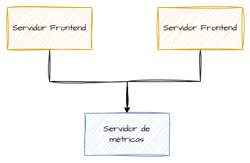
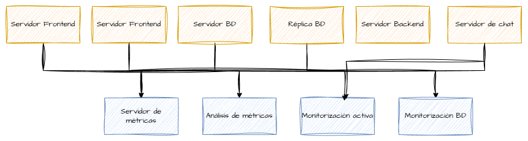
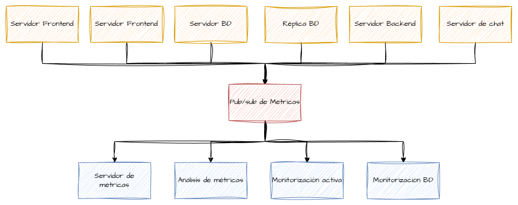
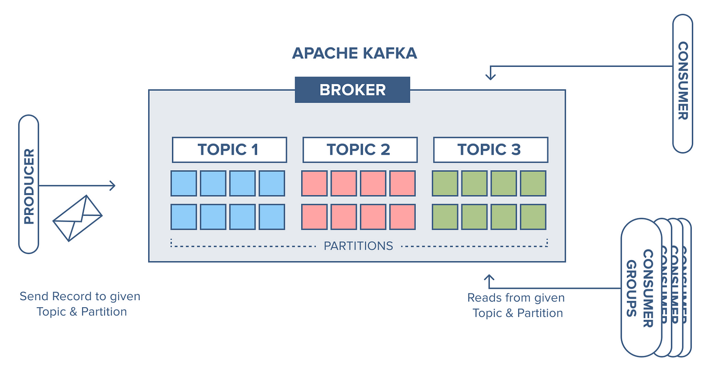

# 1. Kafka: que é e que problema resolve

Apache Kafka é unha plataforma distribuída para a xestión de fluxos de eventos (*event streaming*). Está deseñada para permitir a publicación, almacenamento e consumo de grandes volumes de datos en tempo case real, de forma escalable e tolerante a fallos.


Tradicionalmente, os sistemas intercambiaban datos mediante:
- chamadas directas a APIs,
- intercambio de ficheiros,
- sistemas de mensaxería punto a punto.

Estas aproximacións presentan limitacións cando o volume de datos é elevado, os produtores e consumidores son numerosos ou é necesario reprocesar información histórica.

Kafka resolve estes problemas actuando como un **log distribuído de eventos**, no que:
- os produtores publican eventos,
- os consumidores len os eventos ao seu propio ritmo,
- os datos consérvanse durante un tempo configurable, independentemente de se foron consumidos ou non.

Kafka resulta especialmente adecuado para:
- recoller datos de sensores ou dispositivos IoT,
- xestionar logs de aplicacións,
- integrar múltiples sistemas mediante eventos,
- servir como capa de inxestión en arquitecturas Big Data.

# 1.1 Orixe de Kafka
**Kafka** foi desenvolvido inicialmente por traballadores de **LinkedIn** para solucionar un problema que tiñan ao monitorizar as súas aplicacións. Nun exemplo básico, con poucas aplicacións e un só servidor non hai problema:



A medida que se ían engadindo servicios, aplicacións, etc., no nera suficiente cun único servidor de monitorización e a infraestrutura volveuse máis complexa e dificil de manexar:



Como resposta a esto xurdiu Kafka: un sistema de mesaxería publicador/suscritor que recive as métricas dende distintos servidores e as redirixe aos servidores de destino:


---

# 2. Arquitectura básica de Kafka

Kafka está baseado nunha arquitectura distribuída composta por varias pezas fundamentais que traballan conxuntamente para garantir escalabilidade e tolerancia a fallos.


*Fonte: Apache Kafka Architecture – Confluent Blog*


## Broker e cluster

Un **broker** é unha instancia de Kafka que almacena datos e atende as peticións de produtores e consumidores. Un conxunto de brokers forma un **cluster Kafka**, no que os datos se distribúen entre os distintos nodos.


*Fonte: Scaler — Apache Kafka Clusters Architecture* :contentReference[oaicite:0]{index=0}


A existencia de varios brokers permite:
- repartir a carga de traballo,
- escalar horizontalmente,
- evitar puntos únicos de fallo.

## Topics e particións

Os datos en Kafka organízanse en **topics**, que poden entenderse como canles lóxicas de eventos.


Cada topic divídese en **particións**, que son logs ordenados e inmutables. As particións permiten:
- paralelizar a lectura e escritura de datos,
- distribuír os datos entre distintos brokers.

Dentro dunha partición, as mensaxes manteñen a orde na que foron publicadas.



*Fonte: Cluster Big Data Blog — Esquema dun broker de Apache Kafka* ([clusterbigdata.blog.tartanga.eus](https://clusterbigdata.blog.tartanga.eus/2023/11/))


## Replicación

Para garantir a tolerancia a fallos, cada partición pode estar **replicada** en varios brokers. Unha das réplicas actúa como líder, mentres que as demais funcionan como réplicas secundarias.

Se o broker líder falla, outra réplica pode asumir o seu papel, garantindo a dispoñibilidade dos datos.

## ZooKeeper e KRaft

Tradicionalmente, Kafka empregaba **ZooKeeper** para a xestión do estado do cluster. Nas versións máis recentes, Kafka introduce **KRaft**, un mecanismo propio que elimina esta dependencia externa.


*Fonte: SOC Prime — Esquema de Zookeeper vs KRaft na arquitectura de Kafka* :contentReference[oaicite:0]{index=0}


A nivel conceptual, ambos sistemas cumpren a mesma función: coordinar os brokers e manter a coherencia do cluster.

---

# 3. Modelo de datos en Kafka

Kafka traballa con **eventos**, que representan feitos ocorridos nun determinado momento. Cada evento publícase como unha mensaxe inmutable dentro dun topic.

## Estrutura dunha mensaxe

Un evento en Kafka pode conter os seguintes elementos:
- **key**: valor opcional empregado para decidir en que partición se almacena a mensaxe.
- **value**: contido principal do evento (habitualmente en formato JSON).
- **headers**: metadatos adicionais en formato clave-valor.
- **timestamp**: instante temporal asociado ao evento.

Kafka non impón un formato concreto para o `value`, polo que é responsabilidade do produtor definir a estrutura dos datos.

## Importancia da key

A *key* permite controlar a distribución dos eventos entre particións. As mensaxes coa mesma key sempre se almacenan na mesma partición, o que garante a orde relativa entre eventos relacionados.

Un uso adecuado da key é fundamental para:
- manter coherencia nos datos,
- facilitar o procesamento posterior,
- evitar desequilibrios entre particións.

## Inmutabilidade e orde

Unha vez escrita, unha mensaxe non pode ser modificada nin eliminada individualmente. Kafka conserva os eventos segundo a política de retención configurada para o topic.

A orde dos eventos só está garantida **dentro de cada partición**, non a nivel global do topic.

## Boas prácticas no deseño de eventos

Ao definir eventos para Kafka, recoméndase:
- empregar eventos pequenos e autocontenidos,
- incluír información temporal clara,
- evitar estruturas excesivamente complexas,
- manter un esquema consistente ao longo do tempo.

# 4. Producers: publicación de eventos

Os **producers** son as aplicacións encargadas de enviar eventos a Kafka. Un producer publica mensaxes nun topic concreto, e Kafka encárgase de almacenalas na partición correspondente.

## Funcionamento básico dun producer

Cando se publica un evento:
- o producer envía a mensaxe a un broker do cluster,
- Kafka decide en que partición se almacena,
- a mensaxe queda persistida segundo a política de retención do topic.


*Fonte: Daniel Arneam — Visión xeral de Kafka Producer* (https://daniel.arneam.com/blog/apache-kafka-producer/)

O producer non necesita coñecer quen vai consumir os datos nin cando se van consumir, o que permite un forte desacoplamento entre sistemas.

## Uso da key na publicación

Ao publicar unha mensaxe, pódese especificar unha **key**:
- se non se indica key, Kafka distribúe as mensaxes entre particións de forma equilibrada,
- se se indica key, todas as mensaxes coa mesma key van á mesma partición.

O uso da key é especialmente importante cando se quere manter a orde entre eventos relacionados (por exemplo, eventos dun mesmo dispositivo ou usuario).

## Fiabilidade e acknowledgements

Os producers poden configurarse para controlar o nivel de fiabilidade da publicación mediante *acknowledgements*:
- confirmación mínima de escritura,
- confirmación tras replicación,
- control de reintentos en caso de erro.

Estas opcións permiten equilibrar rendemento e seguridade segundo o caso de uso.

---

# 5. Consumers: consumo de eventos

Os **consumers** son as aplicacións que len eventos desde Kafka. A lectura realízase de forma secuencial a partir dun determinado offset dentro de cada partición.

## Lectura baseada en offsets

Cada mensaxe nunha partición ten asociado un **offset**, que indica a súa posición dentro do log. O consumer:
- solicita eventos a partir dun offset concreto,
- procesa as mensaxes en orde,
- avanza progresivamente polos datos dispoñibles.

Kafka non empurra os datos aos consumers; son estes os que solicitan os eventos cando están preparados para procesalos.

## Consumer groups

Os consumers organízanse en **consumer groups**:
- cada grupo representa unha aplicación lóxica consumidora,
- dentro dun grupo, as particións repártense entre os consumers dispoñibles,
- cada partición só pode ser consumida por un consumer do grupo ao mesmo tempo.


*Fonte: gráfico sobre internals de Apache Kafka — representa o consumo en grupo de particións* (https://images.ctfassets.net/gt6dp23g0g38/4YKWvDvHoX9Y4NzdPQZvo5/f1f3811e4e6098a45ba702fed62b6735/Kafka_Internals_064.png) :contentReference[oaicite:0]{index=0}


Isto permite escalar horizontalmente o consumo de datos simplemente engadindo máis consumers ao grupo.

## Reequilibrado

Cando se engade ou elimina un consumer dun grupo, Kafka realiza un **reequilibrado**, redistribuíndo as particións entre os consumers activos.

Este proceso é transparente para os produtores e garante que todas as particións sigan sendo consumidas.

---

# 6. Offsets e retención de datos

Un dos conceptos clave de Kafka é a separación entre **consumo de datos** e **almacenamento de datos**.

## Que é un offset

O offset é un identificador numérico que indica a posición dunha mensaxe dentro dunha partición. Cada consumer group mantén o seu propio estado de offsets.


*Fonte: ilustración de consumo de particións en Apache Kafka (orixe Camo/Auto-mqp host).*

Isto implica que:
- diferentes consumer groups poden ler os mesmos datos de forma independente,
- cada grupo avanza polos datos ao seu propio ritmo.

## Retención de datos

Kafka non elimina as mensaxes cando son consumidas. Os datos consérvanse segundo a política de retención configurada para cada topic:
- por tempo (por exemplo, varios días),
- por tamaño máximo do log.

Unha vez superados estes límites, Kafka elimina os eventos máis antigos.

## Relectura e reprocesado

Grazas á retención de datos e aos offsets, é posible:
- volver ler datos antigos,
 reprocesar eventos históricos,
- lanzar novas aplicacións consumidoras sobre datos xa existentes.

Este comportamento diferencia Kafka claramente das colas de mensaxería tradicionais.

---

# 7. Garantías de entrega

Kafka ofrece diferentes **garantías de entrega** dependendo da configuración dos producers e consumers.

## At-most-once

Neste modo:
- as mensaxes poden perderse en caso de fallo,
- non se producen duplicados.

Priorízase o rendemento fronte á fiabilidade.

## At-least-once

Neste modo:
- garántese que as mensaxes se procesan polo menos unha vez,
- poden producirse duplicados en determinadas situacións.

É o modo máis habitual en sistemas de streaming.

## Exactly-once (visión conceptual)

Kafka permite implementar semánticas de *exactly-once* combinando:
- producers idempotentes,
- control de transaccións,
- xestión coordinada de offsets.

A nivel conceptual, este modo busca que cada evento se procese unha única vez, mesmo en presenza de fallos, aínda que a súa implementación require maior coidado.

## Importancia das garantías

A elección da garantía de entrega depende do tipo de aplicación:
- sistemas críticos priorizan fiabilidade,
- sistemas de monitorización poden priorizar rendemento,
- en moitos casos é necesario xestionar duplicados a nivel de aplicación.

## Resumo
| Garantía de entrega | Posibles perdas de mensaxes | Posibles duplicados | Fiabilidade | Rendemento | Casos de uso habituais |
|--------------------|-----------------------------|---------------------|-------------|-------------|------------------------|
| At-most-once       | Si                          | Non                 | Baixa       | Moi alto    | Métricas non críticas, logs, monitorización básica |
| At-least-once      | Non                         | Si                  | Alta        | Alto        | Streaming de datos, procesamento estándar, pipelines ETL |
| Exactly-once       | Non                         | Non (conceptualmente) | Moi alta    | Medio       | Sistemas críticos, contabilidade, facturación, transaccións |

# Entorno Kafka no clúster de Big Data

O clúster de Big Data empregado no módulo inclúe un servizo Kafka xa configurado para a realización de prácticas. Este servizo utilízase como sistema de inxestión de eventos durante a sesión dedicada a Kafka e nas prácticas posteriores de streaming.

O obxectivo non é a administración do broker, senón o seu uso como compoñente dentro dunha arquitectura de procesamento de datos.

## Servizos dispoñibles

No clúster están dispoñibles dous servizos relacionados con Kafka:

- Un **broker Kafka**, que actúa como punto central de publicación e consumo de eventos.
- Unha **interface web (Redpanda Console)**, empregada para visualizar topics, particións, offsets e mensaxes.

## Configuración do broker Kafka

A continuación móstrase o fragmento do ficheiro `docker-compose.yml` correspondente ao servizo Kafka no clúster.

```yaml
services:
  kafka:
    image: adbgonzalez/kafka:3.9
    container_name: kafka
    hostname: kafka
    networks:
      - cluster
    ports:
      - "9092:9092"
    environment:
      KAFKA_LOG_DIRS: /tmp/kraft-combined-logs
      KAFKA_NODE_ID: "1"
      KAFKA_CONTROLLER_QUORUM_VOTERS: "1@kafka:9093"
      KAFKA_LISTENERS: "PLAINTEXT://:9092,CONTROLLER://:9093"
      KAFKA_ADVERTISED_LISTENERS: "PLAINTEXT://kafka:9092"
      KAFKA_NUM_PARTITIONS: "3"
      KAFKA_AUTO_CREATE_TOPICS_ENABLE: "true"
    volumes:
      - kafka_data:/tmp/kraft-combined-logs

  redpanda-console:
    image: redpandadata/console:latest
    container_name: kafka-ui
    networks:
      - cluster
    ports:
      - "8089:8080"
    environment:
      KAFKA_BROKERS: kafka:9092
    depends_on:
      kafka:
        condition: service_healthy

volumes:
  kafka_data:
```

## Características da configuración

O broker Kafka execútase en modo **KRaft**, polo que non se emprega ZooKeeper. Nun entorno de laboratorio cun único nodo, o propio broker asume tamén o rol de controller.

Kafka escoita no porto 9092 para producers e consumers. O enderezo anunciado aos clientes é `kafka:9092`, resolvible desde os contedores do clúster.

A configuración define tres particións por defecto para os topics e permite a autocreación de topics, o que simplifica o traballo durante as prácticas iniciais.

Os datos almacénanse nun volume Docker para manter os topics entre reinicios do contedor.

## Uso do entorno no laboratorio

Os servizos Kafka e a interface web arráncanse desde o directorio do clúster mediante Docker Compose.

```bash
docker compose up -d kafka redpanda-console
```

## Comprobación do estado do broker

Para verificar que Kafka está operativo execútase:

```bash
docker compose ps
```

O servizo `kafka` debe aparecer en estado *healthy* antes de continuar co laboratorio.

## Acceso á interface web

A interface Redpanda Console está dispoñible no navegador no seguinte enderezo:

```text
http://localhost:8089
```

Desde esta interface pódense observar os topics creados, as particións e as mensaxes publicadas durante os laboratorios.

## Uso das ferramentas de consola de Kafka

As ferramentas oficiais de Kafka execútanse dentro do contedor do broker.

```bash
docker exec -it kafka bash
```

Unha vez dentro do contedor, as ferramentas están dispoñibles no seguinte directorio:

```text
/opt/kafka/bin/
```

## Referencias á documentación oficial

Documentación oficial de Kafka:

```text
https://kafka.apache.org/documentation/
```

Documentación de Redpanda Console:

```text
https://docs.redpanda.com/current/manage/console/
```
# Laboratorio: primeiros pasos con Kafka

Neste laboratorio trabállase directamente con Kafka para comprender o seu funcionamento básico antes de empregar linguaxes ou frameworks de máis alto nivel.

O obxectivo é ver Kafka funcionar como sistema de inxestión de eventos e entender conceptos como topics, publicación, consumo e persistencia dos datos.

---

## Obxectivos do laboratorio

Ao finalizar este laboratorio, deberíase ser capaz de:

- crear e inspeccionar topics en Kafka,
- publicar eventos manualmente,
- consumir eventos desde Kafka,
- comprobar que Kafka conserva os datos independentemente do consumo.

---

## Requisitos previos

- Clúster de Big Data levantado.
- Servizo Kafka operativo no contedor `kafka`.

Para acceder ao contedor de Kafka:

```bash
docker exec -it kafka bash
```

Todos os comandos do laboratorio execútanse dentro deste contedor.

---

## 1. Creación dun topic

Créase un topic chamado `eventos-demo` para empregar durante o laboratorio.

```bash
/opt/kafka/bin/kafka-topics.sh \
  --bootstrap-server kafka:9092 \
  --create \
  --topic eventos-demo \
  --partitions 3 \
  --replication-factor 1
```

Para comprobar que o topic foi creado:

```bash
/opt/kafka/bin/kafka-topics.sh \
  --bootstrap-server kafka:9092 \
  --list
```

E para ver os detalles do topic:

```bash
/opt/kafka/bin/kafka-topics.sh \
  --bootstrap-server kafka:9092 \
  --describe \
  --topic eventos-demo
```

---

## 2. Publicación de eventos co console-producer
O comando `kafka-console-producer.sh` permite **enviar mensaxes a un topic**. Cada liña introducida por teclado envíase como unha mensaxe independente.

### Sintaxe xeral

```bash
kafka-console-producer.sh [opcións]
```

### Parámetros máis relevantes

- `--bootstrap-server <host:porto>`  
  Enderezo do broker Kafka ao que se conecta o producer.

- `--topic <nome-topic>`  
  Topic no que se publican as mensaxes.

- `--property parse.key=true`  
  Indica que a entrada contén unha key e un value.

- `--property key.separator=<carácter>`  
  Separador empregado para distinguir key e value na entrada.

- `--producer-property <propiedade>=<valor>`  
  Permite pasar propiedades adicionais ao producer (por exemplo, configuración de fiabilidade).

Por defecto, se non se indica ningunha opción relacionada coa key:
- a key da mensaxe é `null`,
- o contido introdúcese integramente como value.

---

Arráncase un producer interactivo asociado ao topic `eventos-demo`.

```bash
/opt/kafka/bin/kafka-console-producer.sh \
  --bootstrap-server kafka:9092 \
  --topic eventos-demo
```

No terminal, introdúcense varias liñas de texto, por exemplo:

```
evento 1
evento 2
evento 3
```

Cada liña enviada representa un evento publicado en Kafka.

Para finalizar o producer, prémanse as teclas `Ctrl+C`.

---

## 3. Consumo de eventos co console-consumer
O comando `kafka-console-consumer.sh` permite **ler mensaxes dun topic** e amosalas por pantalla.

### Sintaxe xeral

```bash
kafka-console-consumer.sh [opcións]
```

### Parámetros máis relevantes

- `--bootstrap-server <host:porto>`  
  Enderezo do broker Kafka ao que se conecta o consumer.

- `--topic <nome-topic>`  
  Topic do que se consomen as mensaxes.

- `--from-beginning`  
  Inicia o consumo desde o primeiro offset dispoñible no topic.

- `--group <nome-grupo>`  
  Nome do consumer group que se emprega para o consumo.

- `--property print.key=true`  
  Amosa a key da mensaxe xunto co value.

- `--property print.timestamp=true`  
  Amosa o timestamp asociado á mensaxe.

- `--property key.separator=<texto>`  
  Texto empregado para separar key e value na saída.

Por defecto:
- só se amosa o value da mensaxe,
- non se imprime nin a key nin o timestamp,
- o consumo comeza a partir de mensaxes novas.

---
### 3.1. Consumo desde o inicio do topic

Arráncase un consumer indicando que lea todos os eventos dispoñibles desde o inicio do topic.

```bash
/opt/kafka/bin/kafka-console-consumer.sh \
  --bootstrap-server kafka:9092 \
  --topic eventos-demo \
  --from-beginning
```

Deberían visualizarse os eventos publicados anteriormente.

Para deter o consumer, prémanse as teclas `Ctrl+C`.

---

### 3.2. Consumo só de eventos novos

Arráncase un consumer sen a opción `--from-beginning`.

```bash
/opt/kafka/bin/kafka-console-consumer.sh \
  --bootstrap-server kafka:9092 \
  --topic eventos-demo
```

Mentres o consumer está en execución, publícanse novos eventos desde o producer.  
O consumer amosará unicamente os eventos publicados a partir dese momento.

---

## 4. Kafka conserva os datos

Realízase a seguinte proba:

1. Deter calquera consumer activo.
2. Publicar varios eventos co producer.
3. Deter o producer.
4. Arrancar un consumer con `--from-beginning`.

```bash
/opt/kafka/bin/kafka-console-consumer.sh \
  --bootstrap-server kafka:9092 \
  --topic eventos-demo \
  --from-beginning
```

Obsérvase que os eventos publicados anteriormente seguen dispoñibles.

---

## 5. Observación mediante a interface web (opcional)

Accedendo á interface web de Kafka pódese observar visualmente o estado do topic.

Enderezo da interface:

```
http://localhost:8089
```

Desde esta interface pódese comprobar:
- a existencia do topic,
- o número de particións,
- os offsets asociados,
- as mensaxes publicadas.

---

## Preguntas de reflexión

Responder ás seguintes cuestións:

- Que diferenza existe entre consumir cunha opción `--from-beginning` e sen ela?
- Por que Kafka non elimina os eventos ao seren consumidos?
- Que vantaxe ofrece Kafka fronte a unha cola tradicional neste escenario?

Este laboratorio serve como base para os seguintes exercicios, nos que Kafka será empregado desde aplicacións en Python e posteriormente desde Spark Streaming.
