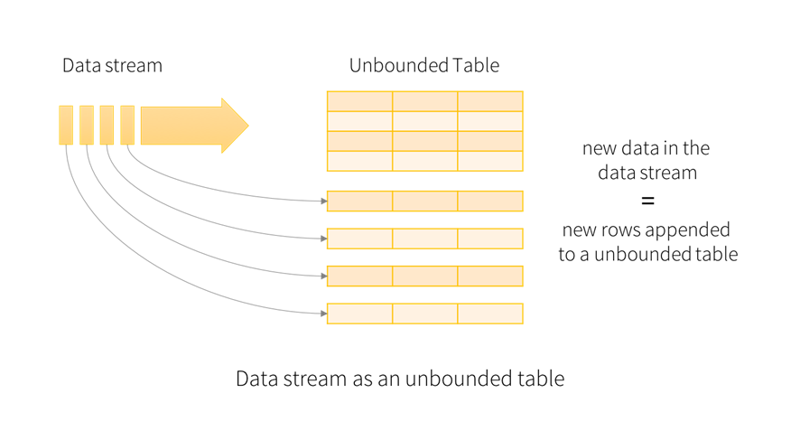
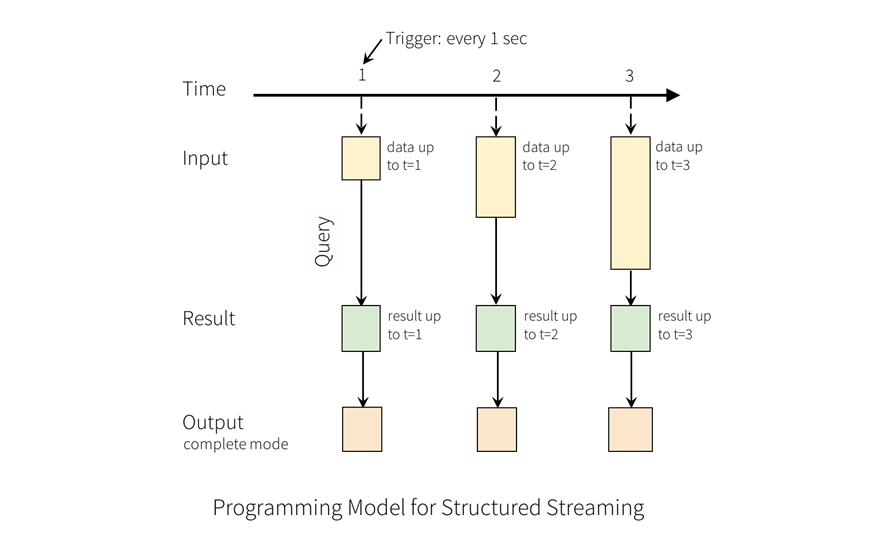

# Procesamento en Streaming con Spark Structured Streaming

> Este documento presenta os **conceptos, modelo de programación e API básica**
> de Spark Structured Streaming.  
> Os **exemplos completos e guiados** con distintas fontes e sumidoiros atópanse en:
>
> ```
> cadernos/03-streaming
> ```

---

## 1. Introdución e contexto

Na actualidade xéranse datos de forma continua: sensores IoT, rexistros de aplicacións, eventos de usuario ou transaccións financeiras. Para extraer valor destes datos, non sempre é viable esperar a procesamentos por lotes de horas ou días.

Tradicionalmente, o Big Data baseouse no **procesamento por lotes (batch)**, pero a necesidade de reaccionar antes deu lugar ao **procesamento en streaming**.

> ⚠️ **Importante**: o *streaming* **non é o mesmo** que o chamado *tempo real* síncrono.

---

## 2. Tipos de procesamento de datos

### 2.1 Procesamento por lotes (batch)
- Procesa grandes volumes de datos de forma periódica.
- Baseado historicamente no paradigma **MapReduce**.
- Exemplos: Hadoop MapReduce, Spark batch.
- Latencias altas (segundos, minutos, horas).

### 2.2 Procesamento síncrono de baixa latencia (mal chamado “tempo real”)
- Modelo *request-response*.
- A aplicación queda bloqueada esperando resposta.
- Usado en TPVs, autorizacións de pagamento, APIs.
- **Non é procesamento distribuído de datos**.

### 2.3 Procesamento en streaming
- Procesa datos de forma continua segundo chegan.
- Modelo asíncrono e non bloqueante.
- Latencias de milisegundos a segundos.
- Exemplos: Spark Structured Streaming, Apache Flink.

---

## 3. Conceptos fundamentais do procesamento en streaming

O procesamento en streaming introduce unha serie de desafíos que non existen
no procesamento por lotes. Estes desafíos están presentes en calquera motor
de streaming distribuído, independentemente da tecnoloxía empregada.

### 3.1 Datos ilimitados (*unbounded data*)

Nun sistema de streaming:
- os datos **non teñen un final definido**
- non existe un “conxunto completo” sobre o que executar unha consulta

Isto implica que:
- as operacións deben executarse de forma incremental
- os resultados poden cambiar co tempo

---

### 3.2 Estado (*state*)

Moitas operacións de streaming requiren **manter información entre eventos**:
- contadores
- agregacións
- ventás temporais

Este estado:
- debe almacenarse de forma distribuída
- debe ser consistente
- pode crecer indefinidamente se non se controla

---

### 3.3 Tolerancia a fallos

Nun clúster distribuído:
- os fallos son normais, non excepcións
- nodos e procesos poden fallar en calquera momento

Un sistema de streaming debe garantir que:
- os datos non se perdan
- os resultados sigan sendo correctos tras un fallo

---

### 3.4 Semántica de procesamento

Os sistemas de streaming definen como se tratan os eventos en caso de fallos:

- **at-most-once**: un evento pode perderse
- **at-least-once**: un evento pode procesarse máis dunha vez
- **exactly-once**: cada evento contribúe exactamente unha vez ao resultado

A semántica escollida afecta directamente ao deseño do sistema e aos *sinks* empregados.

---

### 3.5 Tempo de evento vs tempo de procesamento

Os eventos teñen normalmente un **tempo propio** (*event-time*),
que pode ser distinto do momento no que son procesados.

Isto provoca:
- eventos que chegan tarde
- resultados que deben actualizarse

Os motores de streaming deben poder traballar con *event-time*.

---

### 3.6 Datos tardíos (*late data*)

Os eventos poden chegar:
- fóra de orde
- con retraso respecto á súa ventá temporal

O sistema debe decidir:
- canto tempo esperar
- cando descartar datos antigos

---

### 3.7 Watermarking

Para limitar o crecemento do estado, introdúcese o concepto de **watermark**:
- indica canto tempo se aceptan eventos tardíos
- permite eliminar estado antigo

O watermark representa un compromiso entre:
- precisión dos resultados
- consumo de memoria e recursos

Sen watermarking, o estado asociado a ventás e agregacións
pode crecer indefinidamente, provocando:
- consumo excesivo de memoria
- uso intensivo de disco
- degradación progresiva do rendemento
- fallo da aplicación a longo prazo

Definir un watermark adecuado é unha decisión clave de deseño
nunha aplicación de streaming.


---

### 3.8 Procesamento incremental

A diferenza do batch, no streaming:
- os resultados **actualízanse continuamente**
- non se recalcula todo desde cero

Isto require:
- execución incremental
- control estrito do estado
- mecanismos de checkpoint

### 3.9 Checkpointing e recuperación ante fallos

Para garantir tolerancia a fallos en streaming, os motores deben poder
**recuperar o estado da computación** tras unha caída.

Structured Streaming emprega **checkpointing**, que consiste en:
- gardar periodicamente o estado da consulta
- rexistrar o progreso de lectura das fontes
- permitir a reexecución segura tras un fallo

O checkpoint:
- é obrigatorio para consultas con estado
- é clave para garantir semántica *exactly-once*
- debe almacenarse nun sistema fiable (HDFS, S3, etc.)

Sen checkpointing:
- os resultados poden ser incorrectos tras un fallo
- non se garante consistencia extremo a extremo


## 4. Cumprimento das características de streaming en Spark Structured Streaming e Apache Flink

Os conceptos vistos na sección anterior (estado, tolerancia a fallos, tempo de evento, etc.)
son comúns a calquera sistema de streaming distribuído. Non obstante, **non todos os motores
os implementan do mesmo xeito** nin coas mesmas garantías.

A continuación compáranse **Spark Structured Streaming** e **Apache Flink** respecto
ás principais características do procesamento en streaming.

| Característica | Spark Structured Streaming | Apache Flink |
|----------------|----------------------------|--------------|
| Modelo principal | Micro-batch | Streaming nativo (event-driven) |
| Tipo de datos | Unbounded data | Unbounded data |
| Procesamento incremental | ✅ | ✅ |
| Estado distribuído | ✅ | ✅ |
| Xestión avanzada de estado | Media | Alta |
| Checkpointing | ✅ | ✅ |
| Tolerancia a fallos | ✅ | ✅ |
| Semántica exactly-once | ✅ (dependente do sink) | ✅ (nativa) |
| Event-time | ✅ | ✅ |
| Watermarking | ✅ | ✅ |
| Datos tardíos | ✅ | ✅ |
| Ventás temporais | ✅ | ✅ |
| Latencia típica | Media (ms–s) | Baixa (ms) |
| Throughput | Alto | Alto |
| Unificación batch + streaming | ✅ | ⚠️ (batch como caso especial) |
| API declarativa (SQL / Table API) | ✅ | ✅ |
| Facilidade de uso | Alta | Media |
| Madurez no ecosistema Big Data | Moi alta | Alta |
| Uso educativo / FP | Moi frecuente | Pouco frecuente |

Ambos motores cumpren as características fundamentais do procesamento en streaming,
pero fano con **filosofías distintas**:

- Spark Structured Streaming prioriza:
  - simplicidade
  - reutilización do modelo batch
  - integración co ecosistema Spark

- Apache Flink prioriza:
  - latencia moi baixa
  - precisión temporal
  - control fino do estado e dos eventos

### Diferencias a ter en conta:
#### Spark Structured Streaming
- O streaming constrúese sobre micro-batches.
- O modelo é máis sinxelo de entender se se vén de batch.
- Ideal para pipelines ETL e analítica en streaming.
- A latencia é suficiente para a maioría de casos empresariais.

#### Apache Flink
- O streaming é nativo, non simulado con micro-batches.
- Mellor comportamento en escenarios complexos de eventos.
- Maior complexidade conceptual e operativa.
- Preferido en streaming crítico e de baixa latencia.

> Spark Structured Streaming e Apache Flink resolven os mesmos problemas fundamentais,
> pero están optimizados para escenarios distintos.
>
> Spark é a mellor opción xeralista e educativa.
> Flink é a mellor opción cando o streaming é o corazón do sistema.

> Neste módulo céntrase o estudo en Spark Structured Streaming,
> xa que permite comprender os fundamentos do streaming distribuído
> cunha curva de aprendizaxe máis suave e un maior impacto práctico.


## 5. Spark Structured Streaming

Spark Structured Streaming **non é un motor independente**, senón un **modo de execución do motor Spark SQL** sobre datos ilimitados (*unbounded data*).

As consultas exprésanse igual que en batch (DataFrames/Datasets ou SQL) e Spark:
- executa a computación de forma incremental
- mantén o estado necesario
- garante tolerancia a fallos

### Modelo de execución
Por defecto, Structured Streaming funciona en modo **micro-batch**, procesando o fluxo como unha sucesión de pequenos jobs batch.

A partir de Spark 2.3 existe tamén o modo **continuous** (experimental), con latencias moi baixas pero con importantes limitacións.

---

## 6. Modelo de programación

A idea central é tratar un fluxo de datos como unha **táboa ilimitada** á que se lle engaden filas continuamente.



Unha consulta sobre esta táboa xera unha **táboa de resultados** que se actualiza a medida que chegan novos datos.



Cada vez que a táboa de resultados cambia, os cambios escríbense nun *sink* externo.

---

## 7. Fluxo de traballo típico

1. Crear un `SparkSession`
2. Crear un `Streaming DataFrame` (`readStream`)
3. Aplicar transformacións
4. Definir un *sink* e iniciar a consulta (`writeStream`)


---

## 8. Inicialización de SparkSession

### Exemplo xenérico

```python
from pyspark.sql import SparkSession

# Crear a sesión principal de Spark.
# É o punto de entrada a todas as funcionalidades de Spark
# (DataFrames, Streaming, SQL, etc.)
spark = (
    SparkSession
        .builder
        .appName("StructuredStreamingIntro")  # Nome da aplicación (visible na UI)
        .getOrCreate()
)


```

### Exemplo con Kafka

```python
from pyspark.sql import SparkSession
import pyspark

# Obter a versión de Spark instalada no contorno.
# Isto permite descargar automaticamente o conector Kafka compatible.
spark_version = pyspark.__version__

# Paquete necesario para usar Kafka con Spark Structured Streaming.
# Inclúe o conector spark-sql-kafka e as dependencias axeitadas.
packages = f"org.apache.spark:spark-sql-kafka-0-10_2.12:{spark_version}"

# Crear a SparkSession configurando a descarga automática dos JARs de Kafka.
# IMPORTANTE:
# - Este bloque debe executarse antes de crear calquera SparkSession.
# - Se xa existe unha sesión creada, é necesario reiniciar o kernel.
spark = (
    SparkSession
        .builder
        .appName("StructuredStreamingKafka")   # Nome da aplicación (visible na Spark UI)
        .config("spark.jars.packages", packages)  # Conector Kafka
        .getOrCreate()                           # Crear ou reutilizar a sesión
)


```

(Os exemplos completos de configuración con dependencias están en `cadernos/03-streaming`)

---

## 9. Creación de Streaming DataFrames

### 9.1 Fonte: ficheiros

```python
# Crear un Streaming DataFrame a partir dun directorio de ficheiros.
# Cada ficheiro novo que apareza no directorio será tratado
# como novos datos do fluxo.
streaming_df = (
    spark
        .readStream
        .format("csv")                     # Formato dos ficheiros
        .option("maxFilesPerTrigger", 1)   # Nº máximo de ficheiros por micro-batch
        .load("/ruta/input")               # Directorio de entrada
)


```

### 9.2 Fonte: socket (só probas)

```python
# Crear un Streaming DataFrame lendo texto desde un socket TCP.
# Cada liña recibida considérase un novo evento.
# Esta fonte só debe usarse para probas e demostracións.
socket_df = (
    spark
        .readStream
        .format("socket")          # Fonte tipo socket
        .option("host", "localhost")
        .option("port", 9999)
        .load()
)


```

### 9.3 Fonte: Kafka

```python
# Crear un Streaming DataFrame lendo mensaxes desde Kafka.
# Cada mensaxe corresponde a un evento do fluxo.
kafka_df = (
    spark
        .readStream
        .format("kafka")                                   # Fonte Kafka
        .option("kafka.bootstrap.servers", "kafka-1:9092")
        .option("subscribe", "entrada")                    # Topic de entrada
        .load()
)

```
> Kafka non é un motor de procesamento,
> senón un sistema distribuído de mensaxería.
>
> Spark Structured Streaming consome eventos desde Kafka
> e encárgase do procesamento, estado e tolerancia a fallos.

---

## 10. Operacións sobre Streaming DataFrames

As operacións sobre Streaming DataFrames son moi similares ás de batch:

```python
from pyspark.sql.functions import explode, split

# Transformación do fluxo:
# 1. Dividir cada liña de texto en palabras
# 2. Converter cada palabra nunha fila independente
words = (
    socket_df
        .select(
            explode(                     # Converte un array en varias filas
                split(socket_df.value, " ")  # Divide a liña en palabras
            ).alias("word")              # Nome da columna resultante
        )
)


```

Non todas as operacións están soportadas en todos os modos de saída.

---

## 11. Ventás temporais

Structured Streaming permite agregacións baseadas en **tempo de evento** usando ventás:


Tipos:
- Ventás fixas
- Ventás deslizantes
- Ventás de sesión

```python
from pyspark.sql.functions import window

# Agregación en streaming baseada en ventás de tempo de evento.
# Agrúpanse as palabras en ventás deslizantes de 10 minutos
# que se actualizan cada 5 minutos.
windowed_counts = (
    words
        .groupBy(
            window(
                words.timestamp,       # Columna de tempo de evento
                "10 minutes",          # Duración da ventá
                "5 minutes"            # Desprazamento da ventá
            ),
            words.word                 # Agrupación adicional por palabra
        )
        .count()                       # Conteo por ventá e palabra
)

```


---

## 12. Datos tardíos e watermarking

Os eventos poden chegar tarde respecto ao seu tempo de evento.


Para limitar o estado intermedio emprégase **watermarking**:

```python
from pyspark.sql.functions import window

# Agregación en streaming con ventás de tempo de evento e watermarking.
# - withWatermark(): indica canto tempo se aceptan eventos tardíos
# - window(): define ventás deslizantes de 10 minutos que se actualizan cada 5
# - groupBy(): agrupa por ventá temporal e por palabra
windowed_counts = (
    words
        .withWatermark("timestamp", "10 minutes")          # Límite para datos tardíos
        .groupBy(
            window(
                words.timestamp,                           # Columna de tempo de evento
                "10 minutes",                              # Duración da ventá
                "5 minutes"                                # Desprazamento da ventá
            ),
            words.word                                     # Agrupación adicional por palabra
        )
        .count()                                           # Conteo por ventá e palabra
)

```

---

## 13. Modos de saída

- **Append**: só novas filas
- **Update**: filas modificadas
- **Complete**: táboa completa

A compatibilidade depende do tipo de consulta.
| Tipo de consulta (Structured Streaming) | Append | Update | Complete | Notas |
|----------------------------------------|--------|--------|----------|-------|
| Sen agregación (select, where, map, filter…) | ✅ | ✅ | ❌ | Update equivale a append se non hai estado |
| Agregación con event-time + watermark (ventás) | ⚠️ | ✅ | ✅ | Append só cando a ventá está pechada polo watermark |
| Agregación sen watermark | ❌ | ✅ | ✅ | O estado pode cambiar indefinidamente |
| mapGroupsWithState | ❌ | ✅ | ❌ | Non se permite complete |
| flatMapGroupsWithState (modo Append) | ✅ | ❌ | ❌ | Saída incremental sen actualizacións |
| flatMapGroupsWithState (modo Update) | ❌ | ✅ | ❌ | Actualización de estado por clave |
| Joins en streaming (stream-stream / stream-static) | ✅ | ❌ | ❌ | Update e complete non están soportados |

**Lenda**
- ✅ soportado
- ⚠️ soportado con condicións
- ❌ non soportado

---

## 14. Sinks

Structured Streaming soporta varios *sinks*:

- File
- Kafka
- Foreach / ForeachBatch
- Console (probas)
- Memory (probas)

### Exemplo: Console sink

```python
# Iniciar a consulta de streaming escribindo os resultados na consola.
# Este sink é útil para probas rápidas e demostracións,
# pero non é tolerante a fallos nin válido para produción.
query = (
    wordCounts
        .writeStream
        .format("console")             # Sink de consola (só probas)
        .outputMode("complete")        # Escríbese a táboa completa en cada micro-batch
        .start()                       # Lanza a consulta
)

```

### Exemplo: Memory sink (probas en Jupyter)

```python
# Iniciar a consulta de streaming escribindo os resultados en memoria.
# Este sink é útil para probas en Jupyter ou depuración,
# permitindo consultar os resultados como unha táboa temporal.
query = (
    wordCounts
        .writeStream
        .format("memory")              # Sink en memoria (só para probas)
        .queryName("wc")               # Nome da táboa temporal
        .outputMode("complete")        # Escríbese a táboa completa en cada batch
        .start()                       # Lanza a consulta
)

```

Non todos os *sinks* poden usarse con todos os modos de saída.

| Sink | Append | Update | Complete | Tolerancia a fallos | Notas |
|------|--------|--------|----------|--------------------|-------|
| File | ✅ | ❌ | ❌ | Exactly-once | Ideal para ETL en streaming |
| Kafka | ✅ | ✅ | ✅ | At-least-once | Uso habitual en pipelines |
| Foreach | ✅ | ✅ | ✅ | At-least-once | Depende da lóxica do usuario |
| ForeachBatch | ✅ | ✅ | ✅ | Depende da implementación | Permite lóxica batch personalizada |
| Console | ✅ | ✅ | ✅ | ❌ | Só para probas |
| Memory | ✅ | ❌ | ✅ | ❌ | Só para probas en Jupyter |

**Lenda**
- ✅ soportado
- ⚠️ soportado con condicións
- ❌ non soportado

---

## 15. Triggers

Os *triggers* definen **cando se executa o procesamento**, é dicir,
o ritmo ao que o sistema analiza os datos entrantes.

Non afectan ás operacións que se poden realizar,
senón á **frecuencia e latencia** da execución.

En Structured Streaming, a maioría das consultas execútanse
en modo *micro-batch*, e o trigger controla:
- cando se lanza cada micro-batch
- canto tempo se espera entre execucións


```python
# Iniciar a consulta de streaming usando un trigger de intervalo fixo.
# Cada micro-batch execútase cada 10 segundos como máximo.
query = (
    df
        .writeStream
        .trigger(processingTime="10 seconds")  # Intervalo de execución
        .format("console")                     # Sink de saída (só probas)
        .start()                               # Lanza a consulta
)

```

Outras opcións:
- **Por defecto**: lánzase un micro-batch en canto remata o anterior.
- **processingTime**: establece unha frecuencia máxima de execución.
- **availableNow**: procesa todos os datos dispoñibles e remata (útil para ETL).
- **continuous**: modo experimental de baixa latencia con moitas limitacións.


---

## 16. Conclusións

> Spark Structured Streaming permite reutilizar o modelo declarativo de Spark SQL
> para procesar fluxos de datos con tolerancia a fallos.

Os **exemplos completos**, con Kafka, ficheiros e distintos *sinks*, atópanse en:

```
cadernos/03-streaming
```
### Resumo conceptual do modelo de streaming

Nunha aplicación típica de Spark Structured Streaming:

Fonte de datos  
→ `readStream`  
→ transformacións (select, groupBy, window…)  
→ estado (opcional)  
→ `writeStream`  
→ sink

Elementos clave:
- o **trigger** define cando se executa o procesamento
- o **watermark** limita o estado
- o **output mode** define que se escribe
- o **checkpoint** garante tolerancia a fallos

---

## 17. Erros típicos e boas prácticas en Spark Structured Streaming

O procesamento en streaming introduce unha serie de riscos e decisións de deseño
que non sempre son evidentes ao comezo. A continuación recóllense algúns dos
**erros máis habituais** e as **boas prácticas recomendadas** ao traballar con
Spark Structured Streaming.

---

### 17.1 Confundir fontes de proba con fontes de produción

É habitual empregar fontes como *socket* ou *memory* para facer probas rápidas
ou demostracións. Non obstante, estas fontes:

- non son tolerantes a fallos
- poden perder eventos
- non permiten recuperación tras unha caída

**Boa práctica**  
Empregar fontes persistentes e distribuídas (Kafka, ficheiros en HDFS/S3, etc.)
en calquera pipeline real de streaming.

---

### 17.2 Non definir checkpointing

Un erro frecuente é lanzar consultas de streaming sen configurar unha localización
de *checkpoint*.

Isto pode provocar:
- perda de estado
- resultados incorrectos tras un reinicio
- imposibilidade de garantir semántica *exactly-once*

**Boa práctica**  
Definir sempre unha localización de *checkpoint* en almacenamento fiable
cando a consulta:
- mantén estado
- realiza agregacións
- escribe en *sinks* persistentes

---

### 17.3 Usar ventás sen watermark

As agregacións baseadas en ventás manteñen estado para cada intervalo temporal.
Se non se define un *watermark*:

- o estado nunca se elimina
- o consumo de memoria medra indefinidamente
- a aplicación pode fallar tras longos períodos de execución

**Boa práctica**  
Definir sempre un *watermark* axeitado cando se traballa con ventás de tempo de evento,
axustando o limiar ao atraso máximo esperado dos eventos.

---

### 17.4 Escoller un modo de saída incompatible coa consulta ou co sink

Non todos os modos de saída (*append*, *update*, *complete*) son compatibles con:
- todos os tipos de consulta
- todos os *sinks*

Unha elección incorrecta pode provocar:
- erros en tempo de execución
- resultados incompletos
- comportamento inesperado

**Boa práctica**  
Verificar sempre a compatibilidade entre:
- tipo de consulta
- modo de saída
- *sink* empregado

---

### 17.5 Supoñer semántica exactly-once sen analizala extremo a extremo

A garantía *exactly-once* non depende só do motor de procesamento, senón tamén de:
- fonte de datos
- *sink*
- configuración de checkpointing

**Boa práctica**  
Analizar a semántica de procesamento de extremo a extremo e asumir que,
en moitos casos, a saída será *at-least-once* se o *sink* non soporta idempotencia.

---

### 17.6 Pensar que Kafka realiza o procesamento

Kafka é un sistema distribuído de mensaxería, non un motor de procesamento.
Non realiza:
- agregacións
- transformacións
- xestión de estado

**Boa práctica**  
Separar claramente responsabilidades:
- Kafka → inxestión e persistencia de eventos
- Spark Structured Streaming → procesamento, estado e tolerancia a fallos

---

### 17.7 Empregar o modo *continuous* sen coñecer as súas limitacións

O modo de procesamento continuo é experimental e presenta fortes restricións:
- non soporta agregacións
- non soporta ventás
- ten limitacións en fontes e *sinks*

**Boa práctica**  
Empregar o modo *micro-batch* na maioría dos casos, xa que ofrece:
- maior compatibilidade
- semántica máis clara
- estabilidade probada

---

### 17.8 Subestimar o impacto do estado

O estado é un dos aspectos máis críticos no streaming:
- afecta á memoria
- afecta ao rendemento
- afecta á tolerancia a fallos

**Boa práctica**  
Deseñar as consultas minimizando:
- o tamaño do estado
- o número de claves activas
- a duración das ventás

---

### 17.9 Pensar en streaming como “batch rápido”

Aínda que Structured Streaming reutiliza a API de batch, o modelo mental é distinto:
- os datos non rematan
- os resultados evolucionan
- os fallos son esperables

**Boa práctica**  
Deseñar as aplicacións de streaming pensando desde o inicio en:
- execución continua
- recuperación tras fallos
- evolución do estado co tempo

---

### Mensaxe clave para o alumnado

> En streaming, un código que “funciona” durante cinco minutos
> pode fallar tras cinco horas.
>
> O deseño correcto é tan importante como a API utilizada.

---

## 18. Bibliografía e referencias

### Documentación oficial

- Apache Spark Structured Streaming  
  https://spark.apache.org/docs/latest/structured-streaming-programming-guide.html

- Apache Spark SQL, DataFrames and Datasets Guide  
  https://spark.apache.org/docs/latest/sql-programming-guide.html

- Apache Flink – Concepts & Streaming Fundamentals  
  https://nightlies.apache.org/flink/flink-docs-stable/docs/concepts/

- Apache Kafka Documentation  
  https://kafka.apache.org/documentation/

---

### Artigos e recursos técnicos de referencia

- Zaharia, M. et al. (2013).  
  *Discretized Streams: Fault-Tolerant Streaming Computation at Scale*.  
  University of California, Berkeley.

- Akidau, T. et al. (2015).  
  *The Dataflow Model: A Practical Approach to Balancing Correctness, Latency, and Cost*.  
  Google Research.

- Kreps, J. (2014).  
  *Questioning the Lambda Architecture*.  
  https://www.oreilly.com/radar/questioning-the-lambda-architecture/

---

### Libros recomendados

- Karau, H. et al.  
  *Learning Spark (2nd Edition)*. O’Reilly Media.

- Chambers, B.; Zaharia, M.  
  *Spark: The Definitive Guide*. O’Reilly Media.

- Shapira, G. et al.  
  *Kafka: The Definitive Guide*. O’Reilly Media.

---

### Recursos para ampliación

- Confluent Developer – Kafka & Streaming  
  https://developer.confluent.io/

- Databricks Blog – Structured Streaming  
  https://www.databricks.com/blog

---

### Nota para o alumnado

> Non é necesario dominar todos estes recursos para superar o módulo.
> A bibliografía serve como apoio, referencia técnica e punto de partida
> para quen queira profundar no procesamento en streaming.
